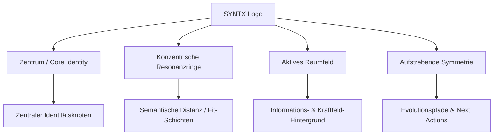

# CONDYN / SYNTX — Semantic Interface Language (SIL) v1.0

> **„Wenn jemand die Oberfläche zum ersten Mal sieht, soll er nicht denken: *Ah, ein Dashboard.* Sondern: *Ich sehe einen Bedeutungsraum.*“**

---

## 1. Semantische Grundprinzipien der Oberfläche

CONDYN / SYNTX ist **kein ERP, kein CRM und kein herkömmliches Analytics-Dashboard**. Es ist ein **semantisches Analyseinstrument**, das Karrieren, Fähigkeiten und organisatorische Resonanzen sichtbar macht.

Die traditionelle GUI-Architektur (Widget-Grids, KPI-Cards, Tabellen, Admin-Boxen) zerlegt zusammenhängende Informationen in unverbundene Container. Die **Semantic Interface Language (SIL)** ersetzt diese Container-Metaphorik durch ein **organisches, strömungsbasiertes System**:

1. **Ganzheitlichkeit statt Segmentierung**: Informationen existieren nicht in isolierten Boxen, sondern als Felder und Knoten in einer kontinuierlichen Topologie.
2. **Kausaler Fluss statt statischer Listen**: Das Interface folgt dem natürlichen Fluss der beruflichen Identitätsentfaltung:
   $$\text{Identity} \longrightarrow \text{Capabilities} \longrightarrow \text{Resonance} \longrightarrow \text{Organizations} \longrightarrow \text{Roles} \longrightarrow \text{Evolution} \longrightarrow \text{Recommendations}$$
3. **Reduktion auf Essenz**: Weißraum und Ruhe sind aktive Gestaltungsmerkmale. Nur dort, wo semantische Energie fließt oder eine Entscheidung getroffen werden kann, tritt visuelle Präsenz auf.

---

## 2. Das SYNTX-Logo als Visuelle Grammatik

Das offizielle SYNTX-Logo ist die primäre semantische Matrix des gesamten Systems. Jedes Element der Oberfläche leitet seine Semantik aus den Eigenschaften des Logos ab:



* **Zentrum**: Der leuchtende Kern steht für den unverfälschten Ursprung – die verifizierte Identität und die Ur-Fähigkeiten eines Kandidaten.
* **Resonanz**: Die konzentrischen Ringe symbolisieren die Ausdehnung der Fähigkeiten in den Markt. Je näher ein Ring am Kern, desto stärker die Resonanz.
* **Feld**: Der dunkle, subtil strukturierte Hintergrund ist kein leerer „Dead Space“, sondern ein Trägermedium für semantische Kraftlinien.
* **Symmetrie & Gleichgewicht**: Vollkommene Balance symbolisiert verifizierte mathematische Präzision.
* **Wachstum**: Aufwärts gerichtete Linien verkörpern das Entwicklungspotenzial und die zielgerichtete Schließung von Lücken.

---

## 3. Die Organische Informationshierarchie

Das Interface erzählt eine kohärente, sechsstufige Geschichte. Der Benutzer durchschreitet den Raum entlang dieser semantischen Hauptachse:

```text
===================================================================================
 [ 01. IDENTITÄT ]          Wer ist diese Person? (Quellen, Ursprung, Signatur)
      │
      ▼
 [ 02. KERNFÄHIGKEITEN ]    Welche Fähigkeiten bilden ihren semantischen Kern?
      │
      ▼
 [ 03. RESONANZ ]           Mit welchen Organisationen schwingt dieser Kern synchron?
      │
      ▼
 [ 04. ROLLEN-FIT ]         Welche konkreten Rollen manifestieren sich im Feld?
      │
      ▼
 [ 05. SPANNUNG / LÜCKEN ]  Wo entstehen semantische Distanzen oder fehlende Bindungen?
      │
      ▼
 [ 06. EVOLUTION ]          Welche Handlung schließt die Lücke und hebt das Niveau?
===================================================================================
```

---

## 4. Raumsemantik: Der Aktive Bedeutungsraum

Statt eines neutralen grauen oder schwarzen Seitenhintergründs mit darauf platzierten Cards nutzt SIL einen **mehrdimensionalen Bedeutungsraum**:

* **Das Kraftfeld (The Void Field)**: Ein tiefes `#03060a` bis `#080c12`, durchzogen von feinen, kaum sichtbaren konzentrischen Orientierungslinien.
* **Semantische Radien**: Distanz im Raum entspricht semantischer Distanz. 
  * Radius $r_0$: Kern-Identität
  * Radius $r_1$: Direkt nachgewiesene Fähigkeiten (90–100% Konfidenz)
  * Radius $r_2$: Primäre Organisations-Resonanzen (Top-Fit)
  * Radius $r_3$: Evolutions- und Transformationsbereiche
* **Keine starren Ränder**: Übergänge zwischen Zonen erfolgen durch sanfte Farb- und Helligkeitsgradienten sowie feine Lichtachsen anstelle von undurchdringlichen Rahmen.

---

## 5. Farbsemantik

Farbe wird radikal sparsam und ausschließlich zur Signalisierung semantischer Energie eingesetzt:

| Token / Farbe | Farbwert | Semantische Bedeutung |
| :--- | :--- | :--- |
| **`SIL_VOID`** | `#030508` | Das ruhende Fundament des Raumes |
| **`SIL_FIELD`** | `#0a0e14` | Subtile Orientierungslinien und Ruhezustände |
| **`SIL_CYAN_ACTIVE`** | `#38e5ff` | **Aktive Resonanz / SYNTX Kernenergie**: Erkannte Stärke, primäre Verbindung, Fokus |
| **`SIL_CYAN_GLOW`** | `rgba(56, 229, 255, 0.25)` | Aura um verifizierte Knoten und Resonanzpfade |
| **`SIL_TEXT_PRIMARY`** | `#e6f1f8` | Hochkontrastige Identitäts- und Rollenbezeichnungen |
| **`SIL_TEXT_MUTED`** | `#596c7a` | Sekundäre Metadaten, Hashes und Kontext |
| **`SIL_TENSION_AMBER`** | `#f5a623` | Semantische Spannung (Capability Gap / Entwicklungsbedarf) |

---

## 6. Typografie & Präzision

* **Monospace-Instrumentierung**: Numerische Werte, Hashes, IDs, Konfidenz-Prozentsätze und Koordinaten werden in präziser Monospace-Schrift (`JetBrains Mono` / `Roboto Mono`) gerendert.
* **Organische Klarheit**: Überschriften und Bezeichnungen nutzen eine klare, hochmoderne Grotesk-Schrift mit großzügigem Letter-Spacing, die an wissenschaftliche Messgeräte erinnert.

---

## 7. Bewegungsprinzipien (Kinetic Semantics)

Bewegung ist in SIL **niemals dekorativ**, sondern transportiert physikalisch-semantische Zustände:

1. **Resonanz-Pulsieren**: Ein sanftes, niederfrequentes Atmen (Sinus-Glow) an Knoten mit hoher Übereinstimmung (>90%).
2. **Aktivierungstransfer**: Beim Fokussieren einer Fähigkeit oder Rolle fließt ein Lichtimpuls entlang der Verbindungslinien zum Zentrum.
3. **Spannungsausgleich**: Wird eine „Next Action“ (Empfehlung) inspiziert, spannt sich eine leuchtende Energieachse zur entsprechenden „Missing Capability“, um visuell zu zeigen, welche Lücke geschlossen wird.

---

## 8. Interaktionsphilosophie

* **Exploration durch Fokus**: Der Benutzer bewegt sich durch den Raum wie durch ein Teleskop oder Mikroskop. Klickt er auf einen Organisationsknoten, fokussiert sich das Feld auf die spezifischen Resonanzbahnen zwischen Identität und dieser Organisation.
* **Kein Modal-Chaos**: Detailinformationen erscheinen als sanft eingeblendete semantische Projektionen direkt am Knoten – nicht in störenden Popups.

---

## 9. Semantisches Layout & Wireframe (Skizze der neuen GUI)

```text
+-----------------------------------------------------------------------------------+
|  (SYNTX LOGO)   CONDYN CAREER INTELLIGENCE FIELD         [ ID: DEMO-ANL-2026-X1 ] |
+-----------------------------------------------------------------------------------+
|                                                                                   |
|                                [ 01. IDENTITY CORE ]                              |
|                          * github.com/codi/edge-core                              |
|                          * Senior_Systems_Architect_CV.pdf                        |
|                                         │                                         |
|                                         ▼                                         |
|                                [ 02. CAPABILITIES ]                               |
|                         ( Sensor Processing 94% )  ──┐                            |
|                         ( Defense AI Inference 89% ) ┼──┐                         |
|                         ( Mesh Orchestration 91% )   │  │                         |
|                                                      │  │                         |
|               ┌──────────────────────────────────────┘  │                         |
|               ▼                                         ▼                         |
|      [ 03. RESONANCE: 92% ]                    [ 03. RESONANCE: 88% ]             |
|         HELSING GMBH                              ANDURIL INDUSTRIES              |
|               │                                         │                         |
|               ▼                                         ▼                         |
|     Senior Defense AI Eng                     Edge Platform Lead                  |
|     Fit: 94%                                  Fit: 87%                            |
|               │                                         │                         |
|               ▼                                         ▼                         |
|    [ TENSION: DO-178C ]                      [ TENSION: MIL-STD-810H ]            |
|               │                                         │                         |
|               └────────────────────┬────────────────────┘                         |
|                                    ▼                                              |
|                         [ 06. EVOLUTION & NEXT ACTIONS ]                          |
|             > Whitepaper Safety-Critical Software Architecture (+3% Fit)          |
|             > Embedded Hardware-in-the-Loop Benchmarks (+4% Fit)                  |
|                                                                                   |
+-----------------------------------------------------------------------------------+
```

---

## 10. Implementierungsleitlinie für Step 22b+

Bevor eine neue Komponente erstellt wird, muss sie folgende SIL-Checkliste bestehen:
1. *Ist es eine Box/Card oder ein organischer Knoten im Feld?* $\rightarrow$ Muss ein Knoten oder Fluss sein.
2. *Wird Farbe dekorativ oder als Energie/Resonanz verwendet?* $\rightarrow$ Nur Cyan für aktive Resonanz.
3. *Erzählt die Anordnung die 6-stufige Geschichte?* $\rightarrow$ Identität $\rightarrow$ Fähigkeiten $\rightarrow$ Resonanz $\rightarrow$ Rollen $\rightarrow$ Spannung $\rightarrow$ Evolution.
